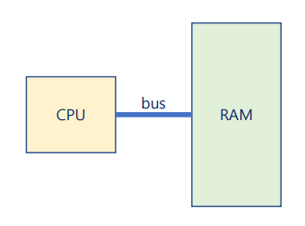
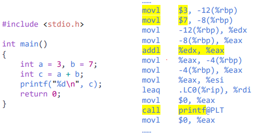
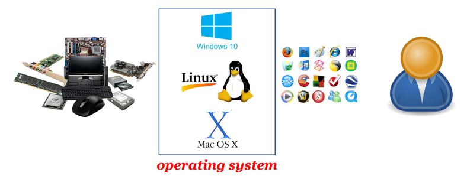

# 운영체제가 뭔가요?
### Operating System : 운영체제
- a software that operates a computer system.
- 컴퓨터 운영체제를 운영하는 소프트웨어.

# 컴퓨터는 뭔가요?
### Computer
- a machine that processes the information : 정보를 처리하는 기계 != calculator

# 정보는 뭔가요?
### Information
- Claude Elwood Shanon : 클로드 섀넌
- a quantitative representation that measures the uncertainty.
- = 불확실한 상황을 측정해서 수치적으로 표현한 것
- $$I(x)=-log_{2}P(x)$$
    - $x$ : 사건 $I$ : 정보량 $P$ : 확률
    - $I$의 단위 : $bit$ = binary digit

# 컴퓨터는 정보를 어떻게 처리하나요?
- 정보의 최소 단위 : bit
    - $8bit = 2^{8}$ = $1byte$
    - $2^{1024}byte$ = 1MB

- 정보의 처리 : 정보의 상태 변환(0 > 1, 1 > 0)

- 변환하는 방법
    - 부울 대수(Boolean Algebra): NOT, AND, OR
    - NOT : 0 > 1, 1 > 0
    - AND : (0, 0) > 0
    - OR : (0, 1) > 1
    - 이런 게이트를 만들면 된다.

- 논리 게이트 : NOT, AND, OR, XOR, NAND, NOR

- 논리 회로(IC) : 트랜지스터로 만들어진 논리 게이트를 집적해서 만듦.
    - IC(Integrated Circuit) : 여러 개의 논리 게이트를 포함. 디지털 신호를 처리하는 데 사용. 다양한 논리 연산을 수행할 수 있는 회로를 소형화하여 하나의 칩에 집적한 것 

- LSI, VLSI, ULSI : IC의 집적도 수준을 나타내는 용어

- SoC(Sytem on Chip) : 다양한 기능을 수행하는 여러 구성 요소를 단일 칩에 통합한 것
    - 무어의 법칙
        - 인텔의 공동 창립자인 고든 무어(Gordon Moore)가 1965년에 제안한 관찰
        - 반도체 집적 회로의 성능, 특히 트랜지스터 수가 약 2년마다 두 배로 증가한다는 내용
        - 컴퓨터 성능이 비약적으로 향상되고, 제조 비용이 감소하는 경향을 설명
        - 주요 내용
            - 트랜지스터 밀도 증가 : 시간이 지남에 따라 같은 면적의 칩에 더 많은 트랜지스터를 집적할 수 있게 되어 성능이 향상
            - 비용 절감: 생산 효율이 개선되면서 단위 성능당 비용이 감소
            - 기술 발전: 새로운 기술과 제조 공정의 발전으로 이러한 경향이 지속될 수 있음을 암시
        - 한계와 논란
            - 무어의 법칙은 과거 몇 십 년 동안 대부분의 경우 성립해왔지만, 최근에는 물리적 한계와 기술적 도전으로 인해 이 법칙이 더 이상 지속되지 않을 것이라는 예측도 있음. 
            - 그럼에도 불구하고, 이 법칙은 반도체 산업과 기술 발전의 중요한 지침으로 여전히 영향을 미치고 있음.
    - 황의 법칙
        - 엔지니어이자 기업가인 제니프 황(Jennifer Huang)에 의해 제안된 것
        - 반도체 제조 공정에서 성능이 두 배로 증가할 때마다 제조 비용이 절반으로 줄어드는 경향을
        - 반도체 산업의 발전과 시장 dynamics를 이해하는 데 중요한 역할

- 정보의 저장과 전송
    - 저장 : 플립-플롭
        - 플립-플롭(flip-flop) : 디지털 회로에서 상태를 저장하는 기본적인 메모리 소자. 플립-플롭은 이진 데이터를 저장하고, 이 데이터를 유지하거나 변경할 수 있는 기능을 가지고 있음.

        - 주요 특징
            1. 상태 저장: 플립-플롭은 0 또는 1의 두 가지 상태를 가질 수 있으며, 입력 신호에 따라 이 상태를 변경

            2. 클럭 신호: 일반적으로 클럭 신호에 의해 작동하며, 특정 조건이 충족될 때만 상태가 변경. 이는 데이터의 안정성과 동기화를 제공.

            3. 종류: 다양한 종류의 플립-플롭이 있으며, 가장 일반적인 것들은 다음과 같습니다:

                - D 플립-플롭: 데이터 입력(D)에 따라 상태를 저장합니다.
                - JK 플립-플롭: 두 개의 입력(J, K)에 따라 상태를 변경하며, 다양한 동작 모드를 지원합니다.
                - T 플립-플롭: 입력이 HIGH일 때 현재 상태를 반전시키는 간단한 형태입니다.
        - 용도
            - 플립-플롭은 레지스터, 카운터, 상태 머신, 메모리 장치 등 다양한 디지털 회로에서 사용됩니다. 이들은 컴퓨터 시스템과 전자 기기의 중요한 구성 요소로, 정보를 저장하고 처리하는 데 필수적입니다.

    - 전송 : 데이터 버스
        - 데이터 버스(Data Bus) : 컴퓨터와 다른 장치 간에 데이터를 전송하는데 사용되는 통신 경로. 데이터 버스는 여러 비트의 데이터를 동시에 전송할 수 있으며, 시스템의 성능에 중요한 역할을 함.

        - 주요 특징
            1. 비트 수 : 데이터 버스는 전송할 수 있는 비트 수에 따라 다릅니다. 예를 들어, 8비트, 16비트, 32비트 또는 64비트 데이터 버스가 있습니다. 비트 수가 많을수록 한 번에 전송할 수 있는 데이터의 양이 많아집니다.

            2. 양방향 전송 : 데이터 버스는 양방향으로 작동할 수 있으며, 이는 데이터가 두 방향으로 전송될 수 있음을 의미합니다. 즉, 데이터는 CPU에서 메모리나 다른 장치로 전송되거나 그 반대 방향으로 전송될 수 있습니다.

            3. 다중화 : 데이터 버스는 여러 장치가 동일한 버스를 공유할 수 있도록 다중화 기술을 사용할 수 있습니다. 이를 통해 효율적으로 자원을 사용할 수 있습니다.

        - 용도
            - 데이터 버스는 CPU, 메모리, 입출력 장치 등 컴퓨터 시스템 내의 다양한 구성 요소 간에 데이터를 전송하는 데 필수적입니다. 버스의 폭과 속도는 시스템의 전체 성능에 큰 영향을 미칩니다.
        
        - +RF ?

- 덧셈? 반가산기, 전가산기
- 뺄셈? 2의 보수 표현법
- 곱셈과 나눗셈? 덧셈과 뺄셈의 반복
- 실수 연산? 부동 소수점 표현법
- 함수? GOTO
- 결과적으로, 삼각함수, 미분, 적분, 사진 촬영, 동영상 재생, ~~ `다 할 수 있다`.

# 컴퓨터가 만능인가요?
- 만능의 범위
    - 범용성 : universality
        - NOT, AND, OR 게이트만으로 모든 계산을 할 수 있다.
        - 진화 > NAND 게이트만으로 모든 계산을 할 수 있다. : NAND 회로를 얼마나 조밀하게 집어넣는가? 가 하드웨어 기술
        - 범용 컴퓨터: general-purpose computer
            - 어떤 목적으로 사용할 것인가에 따라 소프트웨어를 다르게 해서 사용 가능. > computer
            - 특정한 목적으로 만들어 진 것은 소프트웨어로 변경이 불가능 함으로 해당하지 않음.

    - 계산가능성 : computability
        - Turing-computable: 튜링 머신으로 계산가능한 것. = 계산가능성이 있다.
        - 정지 문제: Halting Problem: 튜링 머신으로 풀 수 없는 문제.

# 컴퓨터는 누가 만들었나요?
- 컴퓨터의 할아버지
    - Alan Turing – Turing Machine
- 컴퓨터의 아버지
    - John von Neumann – ISA: Instruction Set Architecture
- 

# 앨런 튜링이 왜 컴퓨터의 할아버지인가요? 
- Head, Tape, Turing Machines, `Universal Turing Machine` 
- CPU, RAM, Application Programs, `Operating System` 
- Turing Machine: 주니온TV (TMItalk: 튜링 머신의 이해> 참조.

# 폰 노이만이 왜 컴퓨터의 아버지인가요? 
- A `stored-program` computer is 
    - a computer that stores `programs` in a memory.
- 폰 노이만이 내장형 프로그램을 처음으로 만들었다.
- 폰 노이만 아키텍처 : ISA

# 프로그램이 뭔데요?
- A program is a set of instructions 
    - that tells a computer's hardware to perform a task.

# 운영체제도 프로그램인가요?
- Operating system 
    - is a program running at all times on the computer 
    - to provide system services to application programs 
    - to manage `processes`, resources, user interfaces, and so on.

# 그래서 운영체제가 뭔가요?

이 사이에서 중간다리 역할을 해줌.