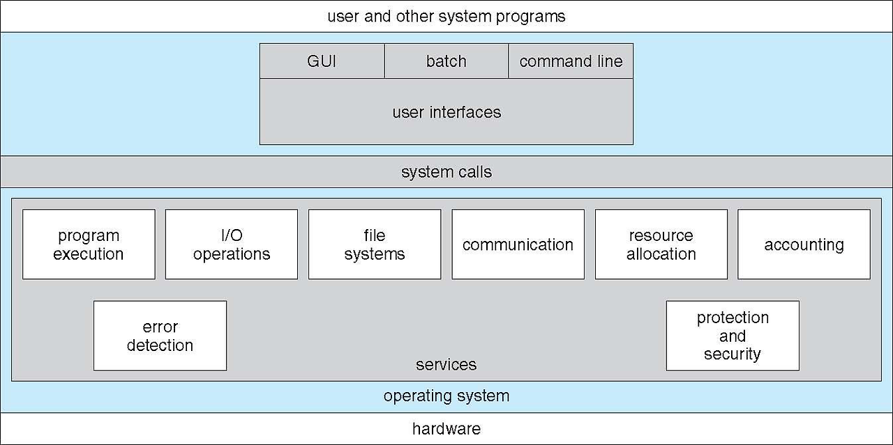

# Chapter 2 Operating-System Structures
운영체제 구조들
## 2.1 Operating-System Services 55
운영체제 제공 서비스

프로그램의 실행을 위해서 운영체제는 다음과 같은 서비스를 제공합니다.

유저 인터페이스(User Interface)
프로그램의 실행(Program execution)
입출력 연산(I/O operation)
파일 시스템 조작(File-system manipulation)
에러 탐색(Error detection)
자원 할당(Resource allocation)
로깅(Logging)
보호 및 보안(Protection and security)
## 2.2 User and Operating-System Interface 58
#### 유저와 운영체제간의 인터페이스
사용자들이 운영체제와 통신하기 위해서 대표적으로 다음과 같은 방법들이 존재합니다.

CLI(Command Line Interface) : 쉘(shells)로 알려진 sh, bash, csh, tcsh, zsh 등이 존재함
GUI(Graphical User Interface) : Windows, MacOS 등
Touch-Screen Interface : Android UI, iPhone UI 등
## 2.3 System Calls 62
#### 시스템 콜
System Calls이란 응용 프로그램이 운영체제와 통신하기 위한 방법입니다.
OS API(Application Program Interface) : System Calls

위의 그림을 보시면 read 함수를 통해서 시스템 콜을 호출하고 커널 모드로 들어가서 파일을 읽을 수 있습니다.

위의 그림을 보시면 사용자 응용프로그램에서 open() 함수를 통해서 시스템 콜을 호출하고 커널 모드로 들어가서 해당하는 파일을 여는 과정입니다.

#### 표준 C 라이브러리
C 라이브러리를 통해서 시스템 콜 인터페이스의 일부를 제공합니다.

## 2.4 System Services 74
## 2.5 Linkers and Loaders 75
## 2.6 Why Applications Are Operating-System Specific 77
## 2.7 Operating-System Design and Implementation 79
## 2.8 Operating-System Structure 81
## 2.9 Building and Booting an Operating  System 92
## 2.10 Operating-System Debugging 95